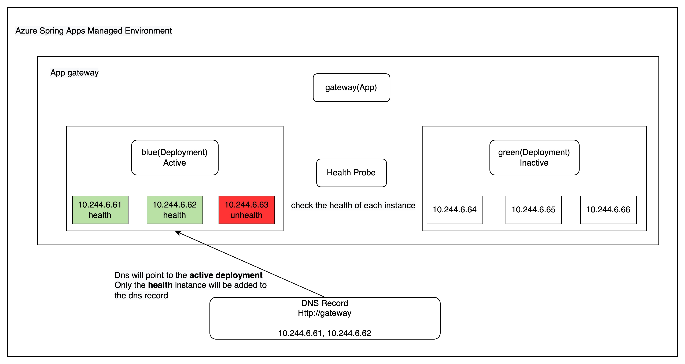
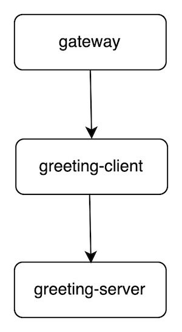

# Service registry in Azure Spring Apps

This sample shows how to use kubernetes service registry in `Azure Spring Apps`.

### Prerequisite

* [JDK 11](https://docs.microsoft.com/azure/java/jdk/java-jdk-install)
* [Maven 3.0 and above](http://maven.apache.org/install.html)
* [Azure CLI](https://docs.microsoft.com/cli/azure/install-azure-cli?view=azure-cli-latest) or [Azure Cloud Shell](https://docs.microsoft.com/azure/cloud-shell/overview)

### Concept
Azure Spring Apps will create a dns record for each app, you can access to the app by http://{AppName} or https://{AppName} if you enable [ingress-app-tls](https://learn.microsoft.com/en-us/azure/spring-apps/how-to-enable-ingress-to-app-tls). 
You can use the url to communicate with other microservices, do not need to import any other dependencies.
It also supports [blue-green deployment](https://learn.microsoft.com/en-us/azure/spring-apps/concepts-blue-green-deployment-strategies).

Azure Spring Apps will probe each instance and put the health instance into the dns record. Following [health probe](https://learn.microsoft.com/en-us/azure/spring-apps/how-to-configure-health-probes-graceful-termination) you can set appropriate configuration.
For blue-green deployment, ASA will put active deployment to the dns record. Inactive deployment will be ignored.

Azure Spring Apps use [iptables proxy mode](https://kubernetes.io/docs/reference/networking/virtual-ips/#proxy-mode-iptables) to handle the traffic. By default, kube-proxy in iptables mode chooses a backend at random.




### Arch
In this sample, we will create 3 apps, gateway, greeting-client, greeting-server.

We will expose public endpoint for gateway, gateway will proxy request to greeting-client, greeting-client will call greeting-server.

All these communications are using kubernetes service registry.



### How to run

1. Run `mvn clean package` under `k8s-service-registry`.
2. Install Azure CLI extension for Azure Spring Apps by running below command.
```
az extension add --name spring
```
3. Create an instance of Azure Spring Apps.
```
az spring create -n <resource name> -g <resource group name>
```
4. Create apps.
```
az spring app create -n gateway -s <resource name> -g <resource group name> --assign-endpoint true
az spring app create -n greeting-client -s <resource name> -g <resource group name> 
az spring app create -n greeting-server -s <resource name> -g <resource group name>
```
5. Deploy app with jar
```
az spring app deploy -n gateway -s <resource name> -g <resource group name> --runtime-version Java_11 --artifact-path gateway/target/gateway-0.0.1-SNAPSHOT.jar
az spring app deploy -n greeting-client -s <resource name> -g <resource group name> --runtime-version Java_11 --artifact-path greeting-server/target/greeting-server-0.0.1-SNAPSHOT.jar
az spring app deploy -n greeting-server -s <resource name> -g <resource group name> --runtime-version Java_11 --artifact-path greeting-client/target/greeting-client-0.0.1-SNAPSHOT.jar
```
6. Verify sample is working. The url is fetched from step 4.
``` 
az spring app show -n gateway -s <resource name> -g <resource group name> | jq -r .properties.url

curl {url}/greeting-client/hello

return client receive 'server says hello' from server side
```